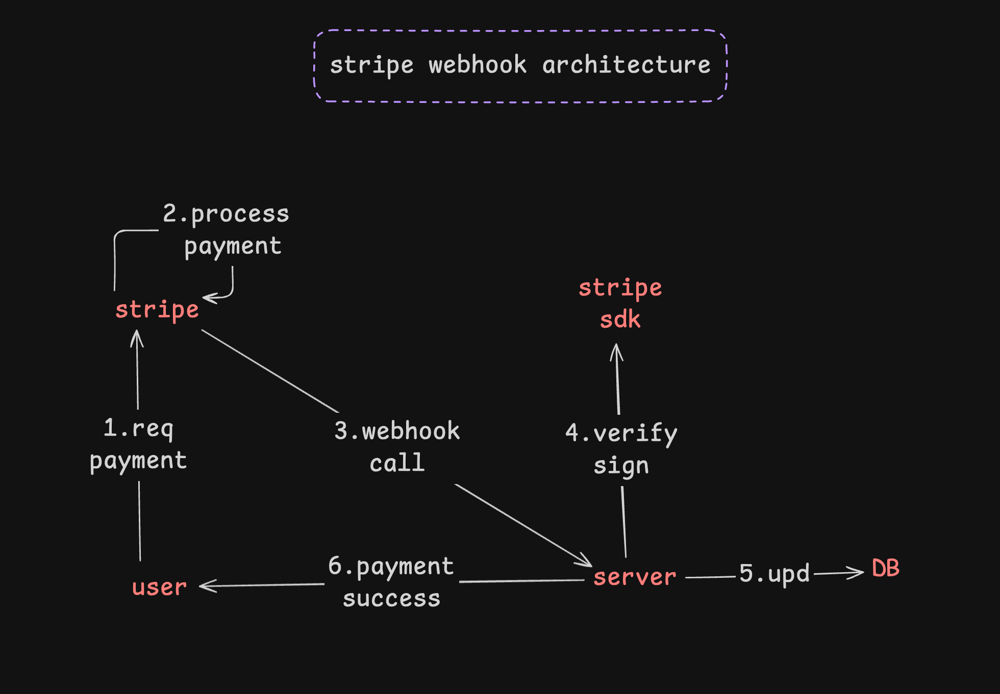

# Stripe Payment Integration Implementation Guide

This document provides a comprehensive guide for the Stripe payment webhook implementation in the ProBeauty Backend.

## Overview

The Stripe payment integration allows the backend to:

- Create payment intents for orders
- Process webhook events from Stripe
- Verify payment signatures for security
- Update order and payment statuses automatically
- Handle payment failures, cancellations, and refunds

---

## Architecture

### Payment Flow

```
1. User initiates checkout (Frontend)
   ↓
2. Backend creates order with PAYMENT_PENDING status
   ↓
3. Backend creates Stripe PaymentIntent
   ↓
4. Backend creates Payment record in database
   ↓
5. Backend returns clientSecret to frontend
   ↓
6. Frontend confirms payment with Stripe
   ↓
7. Stripe processes payment
   ↓
8. Stripe sends webhook to backend
   ↓
9. Backend verifies webhook signature
   ↓
10. Backend updates payment status
   ↓
11. Backend updates order status (CONFIRMED/FAILED)
   ↓
12. Frontend polls for order status update
   ↓
13. Frontend shows success/failure to user
```



---

## Database Changes

### Enhanced Payment Model

The `Payment` model has been updated with the following new fields:

- `stripeEventId` - For webhook idempotency (prevents duplicate processing)
- `stripeCustomerId` - Stripe customer ID
- `metadata` - JSON field for additional Stripe metadata
- `failureReason` - Stores reason for payment failure
- `updatedAt` - Timestamp for last update

---

## Files Created/Modified

### ✅ New Files Created

1. **`src/constants/paymentStatus.ts`**

   - Payment status constants (pending, processing, succeeded, failed, canceled, refunded)
   - Payment provider constants (stripe, cash)

2. **`src/configs/stripe.ts`**

   - Stripe SDK initialization
   - Webhook secret configuration

3. **`src/services/stripeService.ts`**

   - Create PaymentIntent
   - Retrieve PaymentIntent
   - Cancel PaymentIntent
   - Verify webhook signatures
   - Create refunds
   - Customer management

4. **`src/services/paymentService.ts`**

   - Create payment records
   - Update payment status
   - Handle idempotency with stripeEventId
   - Link payments to orders
   - Update order status based on payment status

5. **`src/services/webhookHandlers/stripeWebhookHandler.ts`**

   - Handle `payment_intent.succeeded`
   - Handle `payment_intent.payment_failed`
   - Handle `payment_intent.canceled`
   - Handle `payment_intent.processing`
   - Handle `charge.refunded`

6. **`src/middlewares/stripeWebhookValidator.ts`**

   - Verify Stripe webhook signatures
   - Attach verified event to request

7. **`src/controllers/webhookController.ts`**

   - Webhook endpoint controller
   - Routes events to handlers

8. **`src/routes/webhookRoutes.ts`**

   - Webhook routes with raw body parsing

9. **`src/schemas/paymentSchema.ts`**

   - Validation schemas for payment endpoints

10. **`src/types/express.d.ts`**
    - TypeScript type definitions for Stripe events

### ✅ Modified Files

1. **`prisma/schema.prisma`**

   - Enhanced Payment model with new fields

2. **`src/configs/env.ts`**

   - Added STRIPE_SECRET_KEY validation
   - Added STRIPE_WEBHOOK_SECRET validation

3. **`.env.example`**

   - Added Stripe environment variables

4. **`src/index.ts`**

   - Registered webhook routes with raw body parsing
   - Added webhook routes BEFORE express.json() middleware

5. **`src/services/orderService.ts`**

   - Added `createOrderWithPayment()` function
   - Integrates Stripe PaymentIntent creation
   - Creates payment records

6. **`src/controllers/orderController.ts`**

   - Added `createOrderWithPayment()` controller
   - Added `getOrderPayment()` controller

7. **`src/routes/orderRoute.ts`**
   - Added POST `/orders/checkout` endpoint
   - Added GET `/orders/:id/payment` endpoint

---

## API Endpoints

### Order Endpoints (Authenticated)

#### 1. Create Order with Payment

```
POST /api/v1/orders/checkout
```

**Headers:**

```json
{
  "Authorization": "Bearer <access_token>",
  "Content-Type": "application/json"
}
```

**Request Body:**

```json
{
  "addressId": "clxxxx..."
}
```

**Response (201):**

```json
{
  "message": "Order created successfully. Complete payment to confirm.",
  "data": {
    "order": {
      "id": "clxxx...",
      "userId": "clxxx...",
      "salonId": "clxxx...",
      "total": "150.00",
      "status": "PAYMENT_PENDING",
      "createdAt": "2024-01-01T00:00:00.000Z",
      "orderItems": [...]
    },
    "clientSecret": "pi_xxx_secret_xxx",
    "paymentIntentId": "pi_xxx"
  }
}
```

#### 2. Get Payment Details

```
GET /api/v1/orders/:orderId/payment
```

**Headers:**

```json
{
  "Authorization": "Bearer <access_token>"
}
```

**Response (200):**

```json
{
  "message": "Payment details retrieved successfully",
  "data": [
    {
      "id": "clxxx...",
      "orderId": "clxxx...",
      "provider": "stripe",
      "amount": "150.00",
      "status": "succeeded",
      "txnId": "pi_xxx",
      "stripeEventId": "evt_xxx",
      "createdAt": "2024-01-01T00:00:00.000Z",
      "updatedAt": "2024-01-01T00:05:00.000Z"
    }
  ]
}
```

### Webhook Endpoint (No Authentication)

#### Stripe Webhook

```
POST /api/v1/webhooks/stripe
```

**Headers:**

```json
{
  "stripe-signature": "t=xxx,v1=xxx",
  "Content-Type": "application/json"
}
```

**Note:** This endpoint is called by Stripe, not your frontend.

---

## Environment Variables

Add the following to your `.env` file:

```env
# Stripe Configuration
STRIPE_SECRET_KEY=sk_test_your_stripe_secret_key
STRIPE_WEBHOOK_SECRET=whsec_your_stripe_webhook_secret
```

### Getting Stripe Keys

1. **Secret Key:**

   - Go to [Stripe Dashboard](https://dashboard.stripe.com/)
   - Navigate to Developers → API keys
   - Copy the "Secret key" (starts with `sk_test_` for test mode)

2. **Webhook Secret:**
   - Go to Developers → Webhooks
   - Click "Add endpoint"
   - Enter your webhook URL: `https://yourdomain.com/api/v1/webhooks/stripe`
   - Select events to listen for:
     - `payment_intent.succeeded`
     - `payment_intent.payment_failed`
     - `payment_intent.canceled`
     - `payment_intent.processing`
     - `charge.refunded`
   - Click "Add endpoint"
   - Copy the "Signing secret" (starts with `whsec_`)

---

## Setup Commands

Run these commands in order:

```bash
# 1. Install Stripe SDK
bun add stripe

# 2. Update .env file with Stripe keys (manual step)
# Add STRIPE_SECRET_KEY and STRIPE_WEBHOOK_SECRET

# 3. Generate Prisma client with updated schema
bun run prisma:generate

# 4. Create and apply database migration
bun run prisma:migrate

# When prompted for migration name, use: add_stripe_payment_fields

# 5. Run linter to check for issues
bun run lint

# 6. Fix any linting issues automatically
bun run lint:fix

# 7. Start the development server
bun run dev
```

---

## Testing

### Local Testing with Stripe CLI

1. **Install Stripe CLI:**

   ```bash
   # macOS
   brew install stripe/stripe-cli/stripe

   # Other platforms: https://stripe.com/docs/stripe-cli
   ```

2. **Login to Stripe:**

   ```bash
   stripe login
   ```

3. **Forward webhooks to local server:**

   ```bash
   stripe listen --forward-to localhost:5000/api/v1/webhooks/stripe
   ```

4. **Copy the webhook signing secret** from the CLI output and update your `.env`:

   ```env
   STRIPE_WEBHOOK_SECRET=whsec_xxx_from_cli
   ```

5. **Trigger test events:**
   ```bash
   stripe trigger payment_intent.succeeded
   stripe trigger payment_intent.payment_failed
   ```

### Testing the Flow

1. **Create an order with payment:**

   ```bash
   curl -X POST http://localhost:5000/api/v1/orders/checkout \
     -H "Authorization: Bearer YOUR_ACCESS_TOKEN" \
     -H "Content-Type: application/json" \
     -d '{
       "addressId": "YOUR_ADDRESS_ID"
     }'
   ```

2. **Use the returned `clientSecret` in your frontend** to confirm the payment with Stripe Elements or Stripe.js

3. **Check the order status:**

   ```bash
   curl -X GET http://localhost:5000/api/v1/orders/ORDER_ID \
     -H "Authorization: Bearer YOUR_ACCESS_TOKEN"
   ```

4. **Check payment details:**
   ```bash
   curl -X GET http://localhost:5000/api/v1/orders/ORDER_ID/payment \
     -H "Authorization: Bearer YOUR_ACCESS_TOKEN"
   ```

---

## Security Features

### 1. Webhook Signature Verification

- Every webhook request is verified using Stripe's signature
- Invalid signatures are rejected with 400 status
- Prevents unauthorized webhook calls

### 2. Idempotency

- `stripeEventId` ensures events are processed only once
- Prevents duplicate payment processing
- Database constraint enforces uniqueness

### 3. Raw Body Parsing

- Webhook route uses raw body for signature verification
- Registered before JSON middleware to preserve raw payload

### 4. Authentication

- All order endpoints require JWT authentication
- Users can only access their own orders
- Salon owners can access orders for their salons

---

## Order Status Flow

### Status Transitions

```
PENDING → PAYMENT_PENDING → CONFIRMED → SHIPPED → DELIVERED
                ↓
         PAYMENT_FAILED
                ↓
            CANCELLED
```

### Payment Status Flow

```
pending → processing → succeeded
              ↓
           failed
              ↓
          canceled
              ↓
          refunded
```

---

## Error Handling

### Webhook Errors

The webhook endpoint returns **200 OK** immediately and processes events asynchronously:

- ✅ **Prevents Stripe retries** on temporary failures
- ✅ **Logs all errors** for debugging
- ✅ **Idempotency** handles duplicate events gracefully

### Payment Failures

When a payment fails:

1. Payment status → `failed`
2. Order status → `PAYMENT_FAILED`
3. `failureReason` is stored in the payment record
4. Frontend can retrieve failure reason via payment endpoint

---

## Monitoring & Logging

### What's Logged

- ✅ All webhook events received
- ✅ Payment status updates
- ✅ Order status transitions
- ✅ Signature verification failures
- ✅ Payment processing errors

### Check Logs

```bash
# View server logs
bun run dev

# Filter for payment-related logs
bun run dev | grep -i "payment\|stripe\|webhook"
```

---

## Production Deployment

### Checklist

- [ ] Switch to Stripe live keys (starts with `sk_live_`)
- [ ] Update webhook endpoint in Stripe Dashboard to production URL
- [ ] Use production webhook secret
- [ ] Enable Stripe webhook monitoring
- [ ] Set up error alerting for webhook failures
- [ ] Configure proper logging infrastructure
- [ ] Test with real payment methods
- [ ] Implement proper retry logic for failed webhooks
- [ ] Set up database backups
- [ ] Monitor payment success rates

### Webhook URL

Production webhook URL format:

```
https://api.yourdomain.com/api/v1/webhooks/stripe
```

---

## Troubleshooting

### Issue: Webhook signature verification fails

**Cause:** Wrong webhook secret or raw body not preserved

**Solution:**

1. Verify `STRIPE_WEBHOOK_SECRET` is correct
2. Ensure webhook route is registered BEFORE `express.json()`
3. Check that `express.raw()` is applied to webhook route

### Issue: Events processed multiple times

**Cause:** `stripeEventId` not being stored properly

**Solution:**

1. Run database migration to add `stripeEventId` field
2. Check that field has unique constraint
3. Verify idempotency check in `paymentService.ts`

### Issue: Order status not updating

**Cause:** Webhook not being received or processed

**Solution:**

1. Check webhook is registered in Stripe Dashboard
2. Verify server is accessible from internet
3. Use Stripe CLI to test locally
4. Check server logs for errors

---

## Frontend Integration

### Using the Payment Flow

```javascript
// 1. Create order and get client secret
const response = await fetch('/api/v1/orders/checkout', {
  method: 'POST',
  headers: {
    Authorization: `Bearer ${accessToken}`,
    'Content-Type': 'application/json',
  },
  body: JSON.stringify({ addressId: 'xxx' }),
});

const { data } = await response.json();
const { clientSecret, order } = data;

// 2. Confirm payment with Stripe
const stripe = Stripe('pk_test_xxx');
const { error, paymentIntent } = await stripe.confirmCardPayment(clientSecret, {
  payment_method: {
    card: cardElement,
    billing_details: { name: 'Customer Name' },
  },
});

// 3. Poll for order status update
const checkOrderStatus = async () => {
  const response = await fetch(`/api/v1/orders/${order.id}`, {
    headers: { Authorization: `Bearer ${accessToken}` },
  });

  const { data } = await response.json();

  if (data.status === 'CONFIRMED') {
    // Payment succeeded!
    showSuccessMessage();
  } else if (data.status === 'PAYMENT_FAILED') {
    // Payment failed
    showErrorMessage();
  }
};

// Poll every 2 seconds for up to 30 seconds
const pollInterval = setInterval(checkOrderStatus, 2000);
setTimeout(() => clearInterval(pollInterval), 30000);
```

---

## Additional Resources

- [Stripe API Documentation](https://stripe.com/docs/api)
- [Stripe Webhooks Guide](https://stripe.com/docs/webhooks)
- [Stripe Testing](https://stripe.com/docs/testing)
- [Stripe CLI](https://stripe.com/docs/stripe-cli)

---

## Support

For issues or questions:

1. Check this documentation first
2. Review Stripe Dashboard logs
3. Check server logs for errors
4. Test with Stripe CLI locally
5. Verify environment variables are set correctly

---

**Implementation completed successfully! 🎉**
