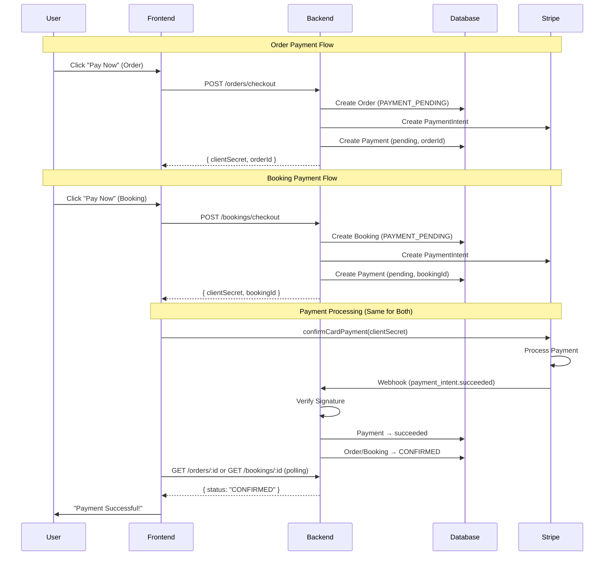

# Stripe Payment Architecture - Complete Integration Guide

This document provides a comprehensive guide to the Stripe payment architecture implementation, including how the backend works and how to integrate with the frontend.

---

## Table of Contents

1. [Architecture Overview](#architecture-overview)
2. [Payment Flow](#payment-flow)
3. [Backend Components](#backend-components)
4. [Schema Design](#schema-design)
5. [API Reference](#api-reference)
6. [Frontend Integration](#frontend-integration)
7. [Webhook Handling](#webhook-handling)
8. [Security Features](#security-features)
9. [Testing Guide](#testing-guide)
10. [Troubleshooting](#troubleshooting)

---

## Architecture Overview

The payment system uses a **webhook-driven architecture** where:

1. Backend creates a PaymentIntent with Stripe
2. Frontend completes the payment using Stripe.js
3. Stripe sends webhook events to confirm payment status
4. Backend updates order/booking/payment status based on webhooks

The system supports payments for both **Orders** (product purchases) and **Bookings** (service appointments).



---

## Payment Flow

### Step-by-Step Flow

#### Order Payment Flow

```
1. USER → Adds items to cart
2. USER → Clicks checkout
3. FRONTEND → Calls POST /api/v1/orders/checkout with addressId
4. BACKEND → Validates cart and address
5. BACKEND → Creates Stripe PaymentIntent
6. BACKEND → Creates Order with PAYMENT_PENDING status
7. BACKEND → Creates Payment record with pending status (orderId)
8. BACKEND → Returns { clientSecret, paymentIntentId, order }
9. FRONTEND → Displays Stripe payment form
10. USER → Enters card details
11. FRONTEND → Calls stripe.confirmCardPayment(clientSecret)
12. STRIPE → Processes payment
13. STRIPE → Sends webhook to backend
14. BACKEND → Verifies webhook signature
15. BACKEND → Updates Payment status to succeeded
16. BACKEND → Updates Order status to CONFIRMED
17. FRONTEND → Polls GET /orders/:id
18. FRONTEND → Sees status = CONFIRMED
19. FRONTEND → Shows success message to user
```

#### Booking Payment Flow

```
1. USER → Selects service, time slot, and staff (optional)
2. USER → Clicks checkout
3. FRONTEND → Calls POST /api/v1/bookings/checkout with booking details
4. BACKEND → Validates booking data and availability
5. BACKEND → Creates Stripe PaymentIntent
6. BACKEND → Creates Booking with PAYMENT_PENDING status
7. BACKEND → Creates Payment record with pending status (bookingId)
8. BACKEND → Returns { clientSecret, paymentIntentId, booking }
9. FRONTEND → Displays Stripe payment form
10. USER → Enters card details
11. FRONTEND → Calls stripe.confirmCardPayment(clientSecret)
12. STRIPE → Processes payment
13. STRIPE → Sends webhook to backend
14. BACKEND → Verifies webhook signature
15. BACKEND → Updates Payment status to succeeded
16. BACKEND → Updates Booking status to CONFIRMED
17. FRONTEND → Polls GET /bookings/:id
18. FRONTEND → Sees status = CONFIRMED
19. FRONTEND → Shows success message to user
```

### Order Status Flow

```
PENDING → PAYMENT_PENDING → CONFIRMED → SHIPPED → DELIVERED
                ↓
          PAYMENT_FAILED
                ↓
            CANCELLED
```

### Payment Status Flow

```
pending → processing → succeeded
              ↓
           failed / canceled → refunded
```

### Booking Status Flow

```
PENDING → PAYMENT_PENDING → CONFIRMED → COMPLETED
                ↓
          PAYMENT_FAILED
                ↓
            CANCELLED
```

---

## Backend Components

### File Structure

```
src/
├── configs/
│   └── stripe.ts              # Stripe SDK initialization
├── constants/
│   └── paymentStatus.ts       # Payment status constants
├── services/
│   ├── stripeService.ts       # Stripe API wrapper
│   ├── paymentService.ts      # Payment database operations
│   ├── orderService.ts        # Order with payment creation
│   └── webhookHandlers/
│       └── stripeWebhookHandler.ts  # Webhook event handlers
├── middlewares/
│   └── stripeWebhookValidator.ts    # Signature verification
├── controllers/
│   ├── orderController.ts     # Checkout endpoints
│   └── webhookController.ts   # Webhook endpoint
└── routes/
    ├── orderRoute.ts          # /orders routes
    └── webhookRoutes.ts       # /webhooks routes
```

### Key Services

#### stripeService.ts

```typescript
// Creates a PaymentIntent with Stripe
createPaymentIntent(amount, currency, metadata)

// Verifies webhook signature
verifyWebhookSignature(payload, signature)

// Creates refunds
createRefund(paymentIntentId, amount?, reason?)

// Customer management
createCustomer(email, name?, metadata?)
retrieveCustomer(customerId)
```

#### paymentService.ts

```typescript
// Database operations with idempotency
createPayment(data)                    // Create payment record
getPaymentByTxnId(txnId)               // Find by PaymentIntent ID
getPaymentByStripeEventId(eventId)     // Idempotency check
updatePaymentStatus(txnId, status, eventId, failureReason?)

// Convenience methods
markPaymentSucceeded(txnId, eventId)
markPaymentFailed(txnId, eventId, reason?)
markPaymentCanceled(txnId, eventId)
markPaymentRefunded(txnId, eventId)
```

---

## Schema Design

### Payment Model

```prisma
model Payment {
  id               String   @id @default(cuid())
  orderId          String?  @map("order_id")      // Optional: for order payments
  bookingId        String?  @map("booking_id")     // Optional: for booking payments
  provider         String                          // "stripe" or "cash"
  amount           Decimal  @db.Decimal(10, 2)
  status           String                          // pending, succeeded, failed, etc.
  txnId            String   @map("txn_id")         // Stripe PaymentIntent ID
  stripeEventId    String?  @unique                // For idempotency
  stripeCustomerId String?                         // Stripe customer ID
  metadata         Json?                           // Additional Stripe data
  failureReason    String?  @db.Text               // Error message if failed
  createdAt        DateTime @default(now())
  updatedAt        DateTime @updatedAt

  order   Order?   @relation(fields: [orderId], references: [id], onDelete: Cascade)
  booking Booking? @relation(fields: [bookingId], references: [id], onDelete: Cascade)
}
```

### Key Fields Explained

| Field           | Purpose                                                    |
| --------------- | ---------------------------------------------------------- |
| `orderId`       | Order ID (optional) - links payment to an order            |
| `bookingId`     | Booking ID (optional) - links payment to a booking         |
| `txnId`         | Stripe PaymentIntent ID (pi_xxx) - links to Stripe         |
| `stripeEventId` | Webhook event ID (evt_xxx) - prevents duplicate processing |
| `failureReason` | Human-readable error from Stripe                           |
| `metadata`      | Stores arbitrary data from Stripe webhooks                 |

**Note:** At least one of `orderId` or `bookingId` must be provided. A payment cannot be associated with both.

---

## API Reference

### POST /api/v1/orders/checkout

Creates an order with Stripe payment.

**Request:**

```json
{
  "addressId": "clxxx..."
}
```

**Response (201):**

```json
{
  "message": "Order created successfully. Complete payment to confirm.",
  "data": {
    "order": {
      "id": "clxxx...",
      "userId": "clxxx...",
      "salonId": "clxxx...",
      "total": "150.00",
      "status": "PAYMENT_PENDING",
      "orderItems": [...]
    },
    "clientSecret": "pi_xxx_secret_xxx",
    "paymentIntentId": "pi_xxx"
  }
}
```

### GET /api/v1/orders/:id/payment

Get payment details for an order.

**Response (200):**

```json
{
  "message": "Payment details retrieved successfully",
  "data": [
    {
      "id": "clxxx...",
      "orderId": "clxxx...",
      "bookingId": null,
      "provider": "stripe",
      "amount": "150.00",
      "status": "succeeded",
      "txnId": "pi_xxx",
      "stripeEventId": "evt_xxx",
      "createdAt": "2024-01-01T00:00:00.000Z",
      "updatedAt": "2024-01-01T00:05:00.000Z"
    }
  ]
}
```

### POST /api/v1/bookings/checkout

Creates a booking with Stripe payment.

**Request:**

```json
{
  "salonId": "clxxx...",
  "serviceId": "clxxx...",
  "staffId": "clxxx...",
  "startTime": "2025-01-15T14:00:00.000Z"
}
```

**Response (201):**

```json
{
  "message": "Booking created successfully. Complete payment to confirm.",
  "data": {
    "booking": {
      "id": "clxxx...",
      "userId": "clxxx...",
      "salonId": "clxxx...",
      "serviceId": "clxxx...",
      "staffId": "clxxx...",
      "startTime": "2025-01-15T14:00:00.000Z",
      "endTime": "2025-01-15T14:30:00.000Z",
      "status": "PAYMENT_PENDING",
      "service": {
        "id": "clxxx...",
        "title": "Haircut",
        "price": "50.00"
      }
    },
    "clientSecret": "pi_xxx_secret_xxx",
    "paymentIntentId": "pi_xxx"
  }
}
```

### GET /api/v1/bookings/:id/payment

Get payment details for a booking.

**Response (200):**

```json
{
  "message": "Payment details retrieved successfully",
  "data": [
    {
      "id": "clxxx...",
      "orderId": null,
      "bookingId": "clxxx...",
      "provider": "stripe",
      "amount": "50.00",
      "status": "succeeded",
      "txnId": "pi_xxx",
      "stripeEventId": "evt_xxx",
      "createdAt": "2024-01-01T00:00:00.000Z",
      "updatedAt": "2024-01-01T00:05:00.000Z"
    }
  ]
}
```

### POST /api/v1/webhooks/stripe

Stripe webhook endpoint (called by Stripe, not frontend).

**Headers:**

```
stripe-signature: t=xxx,v1=xxx
Content-Type: application/json
```

---

## Frontend Integration

### 1. Install Stripe.js

```bash
npm install @stripe/stripe-js @stripe/react-stripe-js
```

### 2. Initialize Stripe

```typescript
// stripeConfig.ts
import { loadStripe } from '@stripe/stripe-js';

export const stripePromise = loadStripe('pk_test_your_publishable_key');
```

### 3. Checkout Flow Implementation

```tsx
// CheckoutPage.tsx
import { useState } from 'react';
import { Elements, PaymentElement, useStripe, useElements } from '@stripe/react-stripe-js';
import { stripePromise } from './stripeConfig';

function CheckoutForm({ clientSecret, orderId }) {
  const stripe = useStripe();
  const elements = useElements();
  const [loading, setLoading] = useState(false);
  const [error, setError] = useState(null);

  const handleSubmit = async (e) => {
    e.preventDefault();
    setLoading(true);

    const { error } = await stripe.confirmPayment({
      elements,
      confirmParams: {
        return_url: `${window.location.origin}/orders/${orderId}/success`,
      },
    });

    if (error) {
      setError(error.message);
      setLoading(false);
    }
    // If successful, user is redirected to return_url
  };

  return (
    <form onSubmit={handleSubmit}>
      <PaymentElement />
      <button disabled={!stripe || loading}>{loading ? 'Processing...' : 'Pay Now'}</button>
      {error && <div className="error">{error}</div>}
    </form>
  );
}

export function OrderCheckoutPage({ addressId }) {
  const [clientSecret, setClientSecret] = useState(null);
  const [orderId, setOrderId] = useState(null);

  useEffect(() => {
    // Call backend to create order and get clientSecret
    fetch('/api/v1/orders/checkout', {
      method: 'POST',
      headers: {
        'Content-Type': 'application/json',
        Authorization: `Bearer ${accessToken}`,
      },
      body: JSON.stringify({ addressId }),
    })
      .then((res) => res.json())
      .then((data) => {
        setClientSecret(data.data.clientSecret);
        setOrderId(data.data.order.id);
      });
  }, [addressId]);

  if (!clientSecret) return <div>Loading...</div>;

  return (
    <Elements stripe={stripePromise} options={{ clientSecret }}>
      <CheckoutForm clientSecret={clientSecret} orderId={orderId} />
    </Elements>
  );
}

export function BookingCheckoutPage({ salonId, serviceId, staffId, startTime }) {
  const [clientSecret, setClientSecret] = useState(null);
  const [bookingId, setBookingId] = useState(null);

  useEffect(() => {
    // Call backend to create booking and get clientSecret
    fetch('/api/v1/bookings/checkout', {
      method: 'POST',
      headers: {
        'Content-Type': 'application/json',
        Authorization: `Bearer ${accessToken}`,
      },
      body: JSON.stringify({ salonId, serviceId, staffId, startTime }),
    })
      .then((res) => res.json())
      .then((data) => {
        setClientSecret(data.data.clientSecret);
        setBookingId(data.data.booking.id);
      });
  }, [salonId, serviceId, staffId, startTime]);

  if (!clientSecret) return <div>Loading...</div>;

  return (
    <Elements stripe={stripePromise} options={{ clientSecret }}>
      <CheckoutForm clientSecret={clientSecret} bookingId={bookingId} />
    </Elements>
  );
}
```

### 4. Polling for Order/Booking Status

```typescript
// useOrderStatus.ts
import { useState, useEffect } from 'react';

export function useOrderStatus(orderId: string) {
  const [status, setStatus] = useState('PAYMENT_PENDING');
  const [loading, setLoading] = useState(true);

  useEffect(() => {
    const pollStatus = async () => {
      try {
        const res = await fetch(`/api/v1/orders/${orderId}`, {
          headers: { Authorization: `Bearer ${accessToken}` },
        });
        const data = await res.json();
        setStatus(data.data.status);

        // Stop polling when order is confirmed or failed
        if (data.data.status === 'CONFIRMED' || data.data.status === 'PAYMENT_FAILED') {
          setLoading(false);
          return;
        }
      } catch (error) {
        console.error('Error polling order status:', error);
      }
    };

    // Poll every 2 seconds
    const interval = setInterval(pollStatus, 2000);

    // Stop after 60 seconds
    const timeout = setTimeout(() => {
      clearInterval(interval);
      setLoading(false);
    }, 60000);

    return () => {
      clearInterval(interval);
      clearTimeout(timeout);
    };
  }, [orderId]);

  return { status, loading };
}

// useBookingStatus.ts
import { useState, useEffect } from 'react';

export function useBookingStatus(bookingId: string) {
  const [status, setStatus] = useState('PAYMENT_PENDING');
  const [loading, setLoading] = useState(true);

  useEffect(() => {
    const pollStatus = async () => {
      try {
        const res = await fetch(`/api/v1/bookings/${bookingId}`, {
          headers: { Authorization: `Bearer ${accessToken}` },
        });
        const data = await res.json();
        setStatus(data.data.status);

        // Stop polling when booking is confirmed or failed
        if (data.data.status === 'CONFIRMED' || data.data.status === 'PAYMENT_FAILED') {
          setLoading(false);
          return;
        }
      } catch (error) {
        console.error('Error polling booking status:', error);
      }
    };

    // Poll every 2 seconds
    const interval = setInterval(pollStatus, 2000);

    // Stop after 60 seconds
    const timeout = setTimeout(() => {
      clearInterval(interval);
      setLoading(false);
    }, 60000);

    return () => {
      clearInterval(interval);
      clearTimeout(timeout);
    };
  }, [bookingId]);

  return { status, loading };
}
```

### 5. Success Pages

```tsx
// OrderSuccessPage.tsx
import { useOrderStatus } from './useOrderStatus';

export function OrderSuccessPage({ orderId }) {
  const { status, loading } = useOrderStatus(orderId);

  if (loading && status === 'PAYMENT_PENDING') {
    return <div>Confirming your payment...</div>;
  }

  if (status === 'CONFIRMED') {
    return (
      <div>
        <h1>Payment Successful! 🎉</h1>
        <p>Your order has been confirmed.</p>
      </div>
    );
  }

  if (status === 'PAYMENT_FAILED') {
    return (
      <div>
        <h1>Payment Failed</h1>
        <p>Please try again or use a different payment method.</p>
      </div>
    );
  }

  return <div>Checking order status...</div>;
}

// BookingSuccessPage.tsx
import { useBookingStatus } from './useBookingStatus';

export function BookingSuccessPage({ bookingId }) {
  const { status, loading } = useBookingStatus(bookingId);

  if (loading && status === 'PAYMENT_PENDING') {
    return <div>Confirming your payment...</div>;
  }

  if (status === 'CONFIRMED') {
    return (
      <div>
        <h1>Payment Successful! 🎉</h1>
        <p>Your booking has been confirmed.</p>
      </div>
    );
  }

  if (status === 'PAYMENT_FAILED') {
    return (
      <div>
        <h1>Payment Failed</h1>
        <p>Please try again or use a different payment method.</p>
      </div>
    );
  }

  return <div>Checking booking status...</div>;
}
```

---

## Webhook Handling

### Events Handled

| Event                           | Handler                         | Effect                                           |
| ------------------------------- | ------------------------------- | ------------------------------------------------ |
| `payment_intent.succeeded`      | `handlePaymentIntentSucceeded`  | Payment → succeeded, Order/Booking → CONFIRMED   |
| `payment_intent.payment_failed` | `handlePaymentIntentFailed`     | Payment → failed, Order/Booking → PAYMENT_FAILED |
| `payment_intent.canceled`       | `handlePaymentIntentCanceled`   | Payment → canceled, Order/Booking → CANCELLED    |
| `payment_intent.processing`     | `handlePaymentIntentProcessing` | Payment → processing                             |
| `charge.refunded`               | `handleChargeRefunded`          | Payment → refunded                               |

**Note:** The webhook handler automatically detects whether the payment is for an Order or Booking based on the `orderId` or `bookingId` field and updates the appropriate entity status.

### Idempotency

The `stripeEventId` field ensures each webhook event is processed exactly once:

```typescript
const existingPayment = await getPaymentByStripeEventId(stripeEventId);
if (existingPayment) {
  console.info(`Event ${stripeEventId} already processed. Skipping.`);
  return existingPayment;
}
```

---

## Security Features

1. **Webhook Signature Verification**

   - Every webhook is verified using Stripe's signing secret
   - Invalid signatures are rejected with 400 status

2. **Raw Body Parsing**

   - Webhook route uses `express.raw()` before `express.json()`
   - Required for signature verification

3. **Idempotency**

   - `stripeEventId` prevents duplicate event processing
   - Protected by unique database constraint

4. **JWT Authentication**
   - All order endpoints require valid JWT token
   - Users can only access their own orders

---

## Testing Guide

### Local Testing with Stripe CLI

```bash
# 1. Install Stripe CLI
brew install stripe/stripe-cli/stripe

# 2. Login
stripe login

# 3. Forward webhooks to local server
stripe listen --forward-to localhost:8000/api/v1/webhooks/stripe

# 4. Copy the webhook signing secret and update .env
STRIPE_WEBHOOK_SECRET=whsec_xxx_from_cli

# 5. Trigger test events
stripe trigger payment_intent.succeeded
stripe trigger payment_intent.payment_failed
```

### Test Card Numbers

| Card      | Number              | Behavior                |
| --------- | ------------------- | ----------------------- |
| Success   | 4242 4242 4242 4242 | Succeeds                |
| Decline   | 4000 0000 0000 0002 | Declines                |
| 3D Secure | 4000 0025 0000 3155 | Requires authentication |

---

## Troubleshooting

### Webhook signature verification fails

1. Verify `STRIPE_WEBHOOK_SECRET` is correct
2. Ensure webhook route is before `express.json()` in index.ts
3. Check that `express.raw()` is applied to webhook route

### Order status not updating

1. Check webhook is registered in Stripe Dashboard
2. Verify server is accessible from internet
3. Use Stripe CLI to test locally
4. Check server logs for errors

### Payment stuck in pending

1. Check if webhook was received (Stripe Dashboard → Webhooks → Logs)
2. Check server logs for processing errors
3. Verify the `txnId` matches between Payment record and PaymentIntent

---

## Environment Variables

```env
# Required for Stripe
STRIPE_SECRET_KEY=sk_test_xxx      # Your Stripe secret key
STRIPE_WEBHOOK_SECRET=whsec_xxx    # Webhook signing secret

# Get from Stripe Dashboard:
# - Secret Key: Developers → API keys
# - Webhook Secret: Developers → Webhooks → Your endpoint
```

---

## Production Checklist

- [ ] Switch to Stripe live keys (sk_live_xxx)
- [ ] Update webhook endpoint in Stripe Dashboard
- [ ] Use production webhook secret
- [ ] Enable webhook monitoring
- [ ] Set up error alerting
- [ ] Configure proper logging
- [ ] Test with real payment methods
- [ ] Set up database backups
- [ ] Monitor payment success rates

---

**Implementation complete! 🎉**
