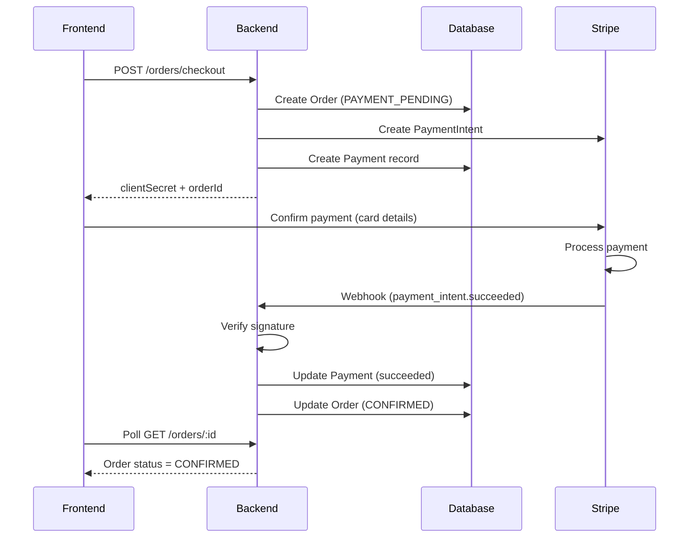

# Stripe Payment Architecture - Implementation Analysis & Plan

This document summarizes the architecture implemented in commits `2445c28` and `16b31b1`, and outlines the schema and code changes made to achieve the Stripe payment integration.

---

## Architecture Overview

The Stripe payment integration follows a **webhook-driven architecture** for reliable payment processing:



---

## Schema Changes Made

### Payment Model Enhancement

The `Payment` model in `prisma/schema.prisma` was extended with Stripe-specific fields:

```diff
model Payment {
  id               String   @id @default(cuid())
  orderId          String   @map("order_id")
  provider         String
  amount           Decimal  @db.Decimal(10, 2)
  status           String
  txnId            String   @map("txn_id")
+ stripeEventId    String?  @unique @map("stripe_event_id")
+ stripeCustomerId String?  @map("stripe_customer_id")
+ metadata         Json?
+ failureReason    String?  @map("failure_reason") @db.Text
  createdAt        DateTime @default(now()) @map("created_at")
+ updatedAt        DateTime @updatedAt @map("updated_at")

  order Order @relation(fields: [orderId], references: [id], onDelete: Cascade)

  @@index([orderId])
  @@index([txnId])
+ @@index([stripeEventId])
  @@map("payments")
}
```

| Field | Purpose |
|-------|---------|
| `stripeEventId` | **Idempotency** - Prevents duplicate webhook processing |
| `stripeCustomerId` | Links to Stripe Customer for future use |
| `metadata` | Stores arbitrary Stripe metadata |
| `failureReason` | Human-readable failure reason from Stripe |
| `updatedAt` | Track last modification time |

---

## Files Created

### 1. Configuration Layer

| File | Purpose |
|------|---------|
| `src/configs/stripe.ts` | Stripe SDK initialization & webhook secret |

### 2. Constants Layer

| File | Purpose |
|------|---------|
| `src/constants/paymentStatus.ts` | `PAYMENT_STATUS` (pending, processing, succeeded, failed, canceled, refunded) |

### 3. Service Layer

| File | Functions | Purpose |
|------|-----------|---------|
| `src/services/stripeService.ts` | `createPaymentIntent`, `verifyWebhookSignature`, `createRefund` | Stripe API wrapper |
| `src/services/paymentService.ts` | `createPayment`, `updatePaymentStatus`, `markPaymentSucceeded/Failed` | Database operations + idempotency |

### 4. Webhook Layer

| File | Purpose |
|------|---------|
| `src/services/webhookHandlers/stripeWebhookHandler.ts` | Event router + individual handlers |
| `src/middlewares/stripeWebhookValidator.ts` | Signature verification middleware |
| `src/controllers/webhookController.ts` | Webhook endpoint controller |
| `src/routes/webhookRoutes.ts` | Webhook routes with raw body parsing |

### 5. Enhanced Order Flow

| File | Changes |
|------|---------|
| `src/services/orderService.ts` | Added `createOrderWithPayment()` - integrates Stripe |
| `src/controllers/orderController.ts` | Added `createOrderWithPayment()`, `getOrderPayment()` |
| `src/routes/orderRoute.ts` | Added `POST /checkout`, `GET /:id/payment` |

---

## Key Architecture Patterns

### 1. Idempotency via `stripeEventId`

```typescript
// paymentService.ts - Prevents duplicate processing
const existingPayment = await getPaymentByStripeEventId(stripeEventId);
if (existingPayment) {
  console.info(`Event ${stripeEventId} already processed. Skipping.`);
  return existingPayment;
}
```

### 2. Transactional Status Updates

```typescript
// Payment + Order updated atomically
const payment = await prisma.$transaction(async (tx) => {
  await tx.payment.updateMany({ where: { txnId }, data: { status, stripeEventId } });
  await tx.order.update({ where: { id: orderId }, data: { status: orderStatus } });
  return payment;
});
```

### 3. Order Status State Machine

```
PENDING → PAYMENT_PENDING → CONFIRMED → SHIPPED → DELIVERED
                ↓
          PAYMENT_FAILED → CANCELLED
```

### 4. Webhook Signature Security

```typescript
// Raw body required for signature verification
app.use('/api/v1/webhooks', express.raw({ type: 'application/json' }));

// Verification middleware
stripe.webhooks.constructEvent(payload, signature, STRIPE_WEBHOOK_SECRET);
```

---

## API Endpoints Added

| Method | Endpoint | Auth | Purpose |
|--------|----------|------|---------|
| `POST` | `/api/v1/orders/checkout` | JWT | Create order + PaymentIntent |
| `GET` | `/api/v1/orders/:id/payment` | JWT | Get payment details |
| `POST` | `/api/v1/webhooks/stripe` | Stripe Signature | Webhook receiver |

---

## Environment Variables Required

```env
STRIPE_SECRET_KEY=sk_test_xxx      # Stripe API secret key
STRIPE_WEBHOOK_SECRET=whsec_xxx    # Webhook signing secret
```

---

## Webhook Events Handled

| Event | Handler | Effect |
|-------|---------|--------|
| `payment_intent.succeeded` | `handlePaymentIntentSucceeded` | Payment → `succeeded`, Order → `CONFIRMED` |
| `payment_intent.payment_failed` | `handlePaymentIntentFailed` | Payment → `failed`, Order → `PAYMENT_FAILED` |
| `payment_intent.canceled` | `handlePaymentIntentCanceled` | Payment → `canceled`, Order → `CANCELLED` |
| `payment_intent.processing` | `handlePaymentIntentProcessing` | Payment → `processing` |
| `charge.refunded` | `handleChargeRefunded` | Payment → `refunded` |

---

## Payment Status Flow

```
pending → processing → succeeded
              ↓
           failed
              ↓
          canceled
              ↓
          refunded
```

---

## Security Features

1. **Webhook Signature Verification** - Prevents unauthorized webhook calls
2. **Idempotency** - `stripeEventId` ensures events processed only once
3. **Raw Body Parsing** - Preserves payload for signature verification
4. **JWT Authentication** - All order endpoints require authentication

---

## Testing (Local)

```bash
# 1. Install Stripe CLI
brew install stripe/stripe-cli/stripe

# 2. Login
stripe login

# 3. Forward webhooks to local server
stripe listen --forward-to localhost:5000/api/v1/webhooks/stripe

# 4. Trigger test events
stripe trigger payment_intent.succeeded
stripe trigger payment_intent.payment_failed
```

---

**Implementation completed based on commits `2445c28` and `16b31b1`** 🎉
